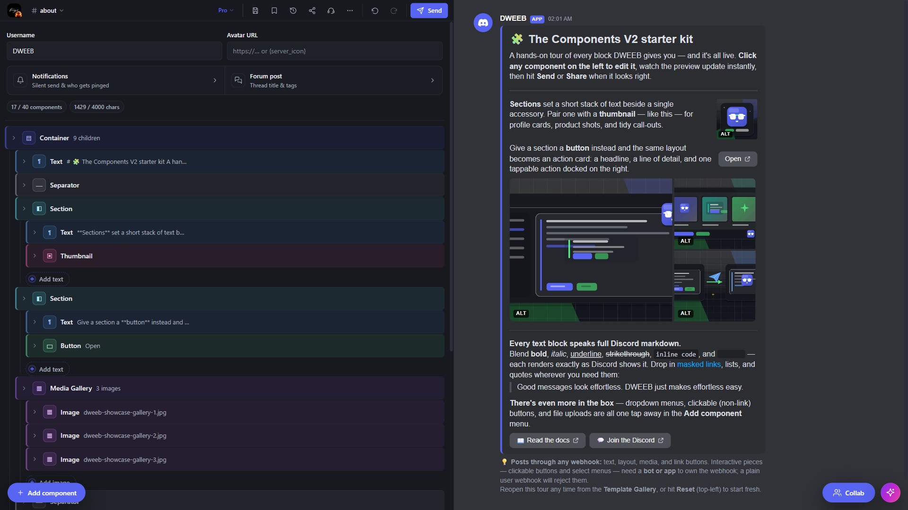

# DWEEB

> **DWEEB** — the **D**iscord **W**ebhook **E**mbed Builder.

A visual editor for Discord webhook messages using **Components V2**. Build rich
messages with containers, sections, buttons, media, and files, watch a
pixel-accurate live preview, and share the result through a single URL — no
backend, no account, no database.

**Private by design.** Everything runs in your browser, so your drafts stay on
your device and share links keep their data in the URL fragment — nothing is
uploaded to us. The only data that leaves your browser is what you opt into
sending: signing in with Discord, the AI assistant, or a plugin you attach.
That makes DWEEB a security-conscious choice for sensitive announcements
and for large communities and teams.

DWEEB is **free and open source** (MIT). The code lives on GitHub at
**[github.com/FaizoKen/DWEEB](https://github.com/FaizoKen/DWEEB)** — issues and
pull requests welcome.



> Try it live at **[dweeb.faizo.net](https://dweeb.faizo.net)**

## First-time users

The editor opens straight to a showcase message so you can see how the
pieces fit together. Start editing in place, or click **Reset** in the
top-left action bar to discard your changes and reload the showcase.

The editor auto-saves your work to this browser only (`localStorage`); a
refresh or revisit picks up where you left off.

Layout at a glance:

- **Left pane** — the editor. A compact action bar at the top hosts every
  global control (undo / redo / Reset / Restore / Share / Send); below it
  the Components ↔ Message tabs flip between the component tree and the
  webhook's username/avatar. Selecting a node opens its inspector below.
- **Right pane** — the Discord-style live preview. Pixel-accurate, so you
  iterate in seconds.

The action-bar buttons:

- **Send** — POST the current message to your webhook URL (or PATCH the
  original when the editor was populated via Restore).
- **Share** — opens the Share / Export dialog (share link, JSON export,
  Import from URL or JSON).
- **Restore** — pull a message your webhook previously posted back into
  the editor so you can keep iterating. Paste the webhook URL + the
  message ID (right-click → *Copy Message ID* with Developer Mode on) or
  the Discord message link.
- **Reset** — replace the current message with the default template
  (undoable).

Privacy: your draft never leaves your browser, and Share URLs put the message in
the `#hash` fragment, which the server never sees. A webhook URL goes to Discord
when you Send (and to a plugin you attach, if you point one at it). The one
opt-in exception: the Share dialog's **Create short link** uploads that message
to the proxy so it can be served from a tiny `…/s/<id>` URL — stored entries
auto-expire and are deleted after 7 days.

```
┌─────────────────────────────────┬────────────────────────────────────────┐
│ [↶] [↷]    Reset · Restore ·    │                                        │
│            [Share]  [ Send ▸ ]  │                                        │
├─────────────────────────────────┤                                        │
│  Components │ Message            │     Discord-style live preview        │
│  ───────────┴──────────         │                                        │
│  ▤ Container                    │                                        │
│   ◧ Section                     │                                        │
│   ¶ Text                        │                                        │
│   ⬚ Buttons Row                 │                                        │
│                                 │                                        │
│  ┌─ Inspector ──────────────┐   │                                        │
│  │  fields for the selected │   │                                        │
│  │  component               │   │                                        │
│  └──────────────────────────┘   │                                        │
└─────────────────────────────────┴────────────────────────────────────────┘
```

## Getting started

```bash
bun install
bun run dev          # http://localhost:5173
bun run build        # produces dist/ (static, ready for any host)
bun run preview      # serve the built bundle locally
bun run typecheck    # tsc -b --noEmit
```

Bun is the supported runtime, but `npm install && npm run dev` works the same
way — Vite is the only thing the scripts actually invoke.

## Deploying to GitHub Pages

The site is a fully static SPA — there is no server-side code in the web build.
Deploys are automated by [`.github/workflows/web.yml`](.github/workflows/web.yml):
every push to `main` that touches the frontend typechecks, builds, and publishes
`dist/` to GitHub Pages (PRs run the same build without deploying).

One-time setup:

1. Repo **Settings → Pages** → Source: **GitHub Actions**.
2. Set the custom domain there and point its DNS `CNAME` at
   `<owner>.github.io` (proxying off, so GitHub can provision the TLS
   certificate). Enable **Enforce HTTPS** once the certificate is issued.

GitHub Pages can't attach response headers, so the Content-Security-Policy is
injected into `index.html` as a `<meta>` tag at build time (see
`vite.config.ts`), and the workflow publishes a `404.html` copy of the shell as
the SPA fallback for deep links.

## Architecture

The codebase is split into four layers. Lower layers never import from higher
ones; that is the rule that keeps the editor scalable.

```
                      ┌────────────────────────────┐
                      │  src/features/             │   <-- React UI
                      │  · builder/  · preview/    │
                      │  · share/                  │
                      └──────────────┬─────────────┘
                                     │
                      ┌──────────────┴─────────────┐
                      │  src/core/state/           │   <-- Zustand store
                      │  src/core/serialization/   │   <-- URL / JSON I/O
                      │  src/core/factory/         │   <-- new-component defaults
                      └──────────────┬─────────────┘
                                     │
                      ┌──────────────┴─────────────┐
                      │  src/core/schema/          │   <-- Discord V2 schema
                      │  types · guards · traversal│       limits · validation
                      └────────────────────────────┘
```

### Layer 1 — Schema (`src/core/schema`)

`types.ts` mirrors the Discord Components V2 wire format. Components are a
tagged union with the numeric `type` field as the discriminator. Editor-only
state (a stable `_id` for selection and reordering) is the only deviation
from the wire format, and it is stripped on export.

- **Discriminated unions, not classes.** TypeScript narrows on `type`
  everywhere; no runtime polymorphism is needed.
- **`guards.ts`** centralizes the `is*` helpers so renderers/inspectors
  never repeat the same check.
- **`traversal.ts`** is the single source of recursion: `walk`, `findById`,
  `updateById`, `removeById`. Reducers never recurse on their own.
- **`limits.ts`** holds every Discord-enforced cap as named constants.
  When Discord raises a limit, change it here and nothing else.
- **`validation.ts`** turns a message into a list of `ValidationIssue`s
  graded `error | warning`. Errors block export; warnings are shown inline.

### Layer 2 — State, Serialization, Factory (`src/core/state`, `…/serialization`, `…/factory`)

- **`messageStore.ts`** is the only Zustand store. It owns the active
  message, the current selection, and an undo/redo ring. Every structural
  edit goes through a named action — no component calls `setState` directly.
  Each action snapshots before mutating, so undo is just "pop a frame".
- **`createComponent.ts`** is the single source of "what a fresh component
  looks like". Both the `+` menus and the importer rely on it, so adding a
  new component type means writing one factory.
- **`serialization/encode.ts`** pipes the editor tree through three stages:
  *strip editor fields* → *JSON* → *LZ-String URL-safe compress*. The
  inverse runs on decode. A `v{N}.<body>` prefix carries the wire-format
  version; `version.ts` registers migrations for future schema bumps.
- **`serialization/url.ts`** owns reading and writing the `#s=<token>`
  hash fragment. Share state lives in the URL hash because hashes never
  reach the server — the share payload stays private to whoever has the URL.
- **`serialization/shortlink.ts`** is the opt-in exception: it POSTs the
  token to the proxy's `/api/shortlink` store (7-day auto-delete) and
  resolves `…/s/<id>` URLs back, consuming the early fetch that
  `index.html` starts in parallel with the bundle download.

### Layer 3 — Features (`src/features`)

- **`builder/`** — tree view, per-component-type inspectors, contextual
  `+` menus. The dispatcher in `Inspector.tsx` switches on `type` and
  delegates to a dedicated `…Inspector` component per type. Adding a new
  component type means adding one inspector file and one entry in the
  switch — nothing else.
- **`preview/`** — the live Discord-style render of the message. The
  `markdown/` subfolder is a small Discord-flavored markdown parser
  (`parse.ts`) and a JSX renderer (`Markdown.tsx`) sitting strictly above
  it. Component renderers go through `renderers/ComponentRenderer.tsx`,
  which is the mirror image of the inspector dispatcher.
- **`share/`** — the share/export/import modal. Stateless w.r.t. the
  store; reads on open, writes through `replaceMessage` on import.
- **`ai/`** — the bring-your-own-key assistant panel. Provider adapters
  and the provider-neutral result type live in `src/core/ai`; see the
  *AI assistant* section below.

### Layer 4 — App shell (`src/app`)

`App.tsx` composes everything. Two hooks live here:

- **`useShareUrlBootstrap`** — on first mount, decodes `#s=<token>` (if
  any) — or resolves a `/s/<id>` short link against the proxy — and
  replaces the active message. Failures surface as a toast; the editor
  still opens.
- **`useKeyboardShortcuts`** — global `Cmd/Ctrl+Z` and `Cmd/Ctrl+Shift+Z`
  for undo/redo. Ignored while the user is typing in a field.
- **`useAutoSaveDraft`** — subscribes to the message store and writes the
  wire payload to `localStorage` (debounced 300ms). Combined with the
  bootstrap path in `messageStore`, this is what makes a refresh resume the
  in-progress message. The draft is keyed `dweeb.draft.v1` and is plain text
  — no credentials live there.

An `ErrorBoundary` wraps the whole app so a bad inspector edit can't blank
the page.

## Adding a new component type

This is the test of how well the layers hold up. Adding a hypothetical
"poll" component:

1. Add a `PollComponent` variant to `src/core/schema/types.ts` and include
   it in the relevant unions (`TopLevelComponent`, etc).
2. Add `isPoll` to `src/core/schema/guards.ts`.
3. Add an entry to `COMPONENT_META` in `src/core/schema/metadata.ts` and
   include the type in `TOP_LEVEL_PICKER` / `CONTAINER_PICKER` as
   appropriate.
4. Add `createPoll` to `src/core/factory/createComponent.ts` and register
   it in `COMPONENT_FACTORIES`.
5. Add validation rules in `src/core/schema/validation.ts`.
6. Add a `PollRenderer` in `src/features/preview/renderers/` and wire it
   into `ComponentRenderer.tsx`'s switch.
7. Add a `PollInspector` in `src/features/builder/components/inspectors/`
   and wire it into `Inspector.tsx`.

No other file needs to change. The dispatchers are exhaustive switches, so
TypeScript will flag any place you forgot.

## Sending, restoring, and updating

The **Send** tab in *Share / Send / Export* posts the current message to a
Discord webhook directly from the browser (Discord allows CORS on the
webhook execute endpoint). On this path the webhook URL goes straight to Discord
and never passes through a DWEEB backend; history is opt-in per submission and
stored in `localStorage` only.

The **Restore** tab does the inverse: paste a webhook URL plus a message ID
(or link) and the editor pulls the message back via
`GET /webhooks/{id}/{token}/messages/{message_id}`. After restoring, the
Send tab automatically switches into "Update the original" mode, which
sends a **PATCH** instead of a POST so your edits replace the live message
rather than posting a copy. You can switch back to "Send as a copy" with
one click — both modes share the same webhook input.

Authorization caveat: only the webhook that *originally posted* a message
can fetch or edit it. A user-, bot-, or different-webhook-authored message
in the same channel will 404. We surface that explicitly in the Restore
panel because the raw error is misleading.

Servers with the DWEEB bot get a faster path into the editor: right-click
any message → **Apps → Edit in DWEEB** replies (privately) with a link that
opens the editor pre-loaded with that message — no Developer Mode, no
message IDs. The same menu offers **Export JSON** (the message's wire
payload) and **Message Info** (author, timestamps, ids, and the message's
component-expiry status — with a permanent-slot toggle button for admins);
right-clicking a *user* offers **Use as Webhook Identity**, which prefills
the webhook name and avatar from that member. The message data rides inside the link's `#fragment`, so it
never touches a server — same privacy story as Share links.

`src/core/webhook/send.ts` owns all three HTTP calls (`sendToWebhook`,
`fetchWebhookMessage`, `updateWebhookMessage`) — status mapping,
rate-limit parsing, and abort support are shared. `src/core/webhook/history.ts`
owns the localStorage list of remembered webhooks. The CSP (injected at build
time from `vite.config.ts`) allows any `https:` host under `connect-src`, so
Discord's domains — and a different host, if you fork the app — need no
allow-list changes.

## AI assistant

The **AI** panel lets you describe a message in plain language and have a
model build or edit the Components V2 payload for you. It's
bring-your-own-key: the key lives only in your browser's `localStorage` and
is sent only to the provider you pick. `src/core/ai/providers.ts` holds one
adapter per wire schema — OpenAI-compatible (`/chat/completions`), Anthropic
(`/v1/messages`), and Gemini (`:generateContent`) — and normalizes all three
to a single `{ ok, text, error }` result. Supported providers: **Groq**,
**OpenRouter**, **OpenAI**, **Anthropic**, **Google Gemini**, and **Ollama**
(Groq, OpenRouter, and Ollama all speak the OpenAI API, so they share one
adapter).

**Self-hosted models via Ollama.** Ollama has to be reachable at a public
`https://` URL: provider calls go straight from your browser, and a page served
over `https://` can't fetch plain-`http://` `localhost` (mixed content). So put
Ollama behind a tunnel and use that URL:

```bash
ollama pull llama3.2
cloudflared tunnel --url http://localhost:11434   # prints an https URL
```

Then pick *Ollama (self-hosted)* in the provider dropdown, set the Base URL to
the tunnel origin plus `/v1` (e.g. `https://xxxx.trycloudflare.com/v1`), and
leave the key blank. There is no default Base URL on purpose: `localhost` can't
work from the deployed site, so you supply your own public endpoint. The browser
calls Ollama directly, so allow the site's origin with
`OLLAMA_ORIGINS=https://dweeb.faizo.net` (or `*`) when starting Ollama.

## Wire-format compatibility

The exported payload (from the **JSON export** tab) is the body you POST to
`https://discord.com/api/webhooks/{id}/{token}?with_components=true`. Both
the `?with_components=true` query parameter **and** the `IS_COMPONENTS_V2`
message flag (`1 << 15`) are mandatory — Discord otherwise parses the body as
legacy components and rejects a top-level Container. The exported body already
includes the computed `flags` (`IS_COMPONENTS_V2`, plus `SUPPRESS_NOTIFICATIONS`
when silent send is on), so it is postable as-is; `computeMessageFlags` in
`src/core/schema/types.ts` is the single source of truth, shared by Send,
JSON export, and share links.

The exporter strips:
- editor `_id` fields,
- any `undefined` optional (kept null when the user explicitly cleared it).

and emits the wire-only `flags` integer (read back into `suppress_notifications`
on import, so the silent-send toggle round-trips).

## Tech stack

- **Runtime**: Bun (also runs on Node 20+)
- **Bundler**: Vite 5 with `@vitejs/plugin-react-swc`
- **UI**: React 18 + TypeScript strict
- **State**: Zustand
- **Compression**: LZ-String (URL-safe encoding)
- **Styling**: CSS Modules + CSS variables (no runtime CSS-in-JS)

The first-paint bundle is the editor only; `lz-string` is split into its own
chunk because decoding is only needed when landing on a share URL.

## Deployment

Hosted on GitHub Pages with automatic builds and deploys on every push
(see [`.github/workflows/web.yml`](.github/workflows/web.yml)).

## Contributing

Contributions are welcome. Open an issue to discuss a change, or send a pull
request. Run `bun run typecheck` and `bun run build` before submitting so CI
stays green.

## License

DWEEB is open source under the [MIT License](LICENSE) — use it, fork it, and
ship it. See [`LICENSE`](LICENSE) for the full text.

The hosted instance at [dweeb.faizo.net](https://dweeb.faizo.net) is also
governed by its [Terms of Service](https://dweeb.faizo.net/terms) and
[Privacy Policy](https://dweeb.faizo.net/privacy).
