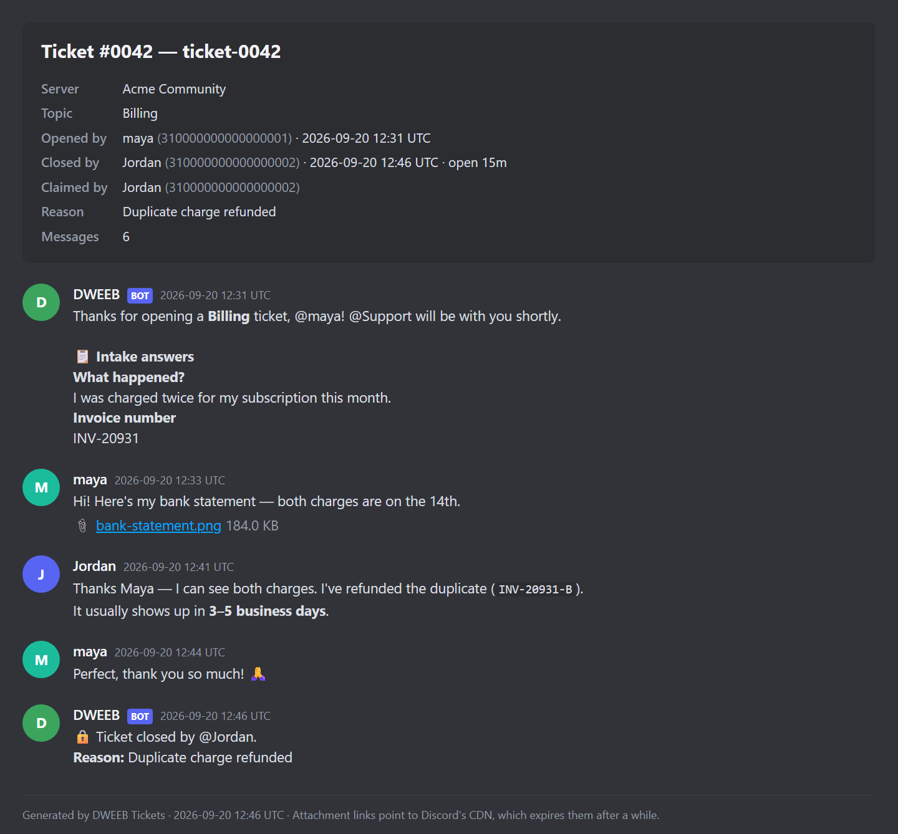
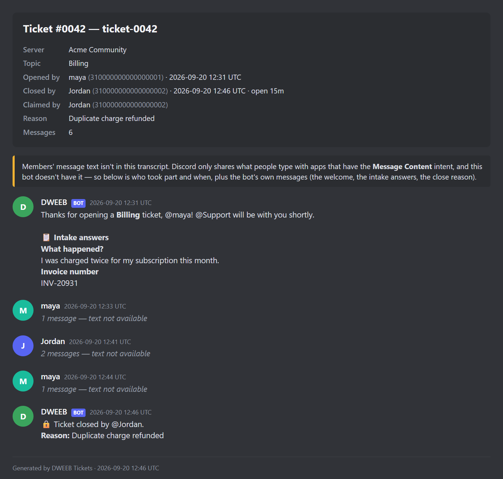

# Tickets — a DWEEB plugin

Attach this to an **interactive button** ("Open a ticket") or a **string select**
(a topic menu) in DWEEB and members can open a **private support ticket** — no
moderator in the loop to create the channel. When a Discord user clicks:

1. the plugin runs an **anti-spam check** (open-ticket limit, cooldown, and a
   guard that makes a double-click one ticket),
2. optionally pops an **intake form** (a modal you design),
3. creates a **private channel** only the opener + your staff can see,
4. posts a **welcome message** (templated) with **Close** / **Claim** /
   **Members** controls, then the intake answers,
5. replies privately with a link to the new ticket.

Staff **claim** a ticket to take ownership (and release it), **add or remove
people**, and **close** it (with an optional reason) to either delete the
channel or lock it for the record. An **HTML transcript** is filed to your log
channel — and, if you like, DMed to the opener — on the way out.

Classic uses: support desks, report intake, application reviews, modmail-style
contact buttons, "talk to an admin" panels with per-topic routing.

It's a single small Rust service that *is* its own registry, config UI, config
API, and Discord interactions endpoint — backed by one SQLite file. Like
[Self Role](../self-role/) it needs a **bot token**, because creating a channel
and setting who can see it are Discord REST calls that require **Manage Channels**
and **Manage Roles**.

```
DWEEB  ──reads──▶  GET /registry.json
DWEEB  ──embeds─▶  GET /config.html  ◀─connect/save─▶  /api/connect, /api/instances  ──▶  SQLite
Discord ─clicks─▶  POST /interactions
   open    ──▶ reserve a slot ──▶ (intake modal?) ──▶ create private channel ──▶ welcome + controls ──▶ link
   claim   ──▶ record it, flip the button in place (Unclaim releases it)
   members ──▶ private picker ──▶ add / remove member overwrites
   close   ──▶ (reason modal?) ──▶ delete (notice → transcript → delete)  OR  lock (read-only + Reopen/Delete)
```

## What a great ticket system needs — and what this does

| Need | How it's handled |
|---|---|
| **One private space per ticket** | A `#ticket-0001` (or `#ticket-<username>`) text channel under your category, with overwrites that hide it from `@everyone` and grant the opener, your staff roles, and the bot. |
| **Triage up front** | An optional **intake form** (0–5 modal questions) shown *before* the channel is created. Answers are posted right after the welcome, split across messages as needed — never cut off. |
| **Topic routing** | On a **string select** panel each option is a topic (Billing, Bug, …). DWEEB wires + locks the option values for you. Each topic can also send its tickets to **its own category** and add **its own staff roles** (a Billing team that sees billing tickets only). |
| **Staff handling** | Designated **staff roles** see every ticket. **Claim** assigns ownership so two people don't double up (**Unclaim** hands it back; a server manager can release anyone's). **Members** lets staff add or remove individual people. |
| **Clean close** | **Close** asks for an optional reason (doubles as a confirmation). *Delete* mode tells everyone in the channel who closed it and why, counts down five seconds, files the records, and deletes. *Lock* mode keeps the channel read-only for everyone but staff, with **Reopen** / **Delete**. |
| **Records** | A self-contained **HTML transcript** (up to the last 500 messages, with the ticket's details up top) in your **log channel**, optionally **DMed to the opener**, plus open / close / reopen / delete log lines. See [the Message Content caveat](#transcripts-and-the-message-content-intent). |
| **Anti-spam** | A per-member **open-ticket limit** and a **cooldown**, enforced *before* a channel is ever created, atomically — a double-click is one ticket even with no limits set. A member at the limit is pointed at the ticket they already have. |
| **Friendly setup** | Quick path = pick your staff role and Save; everything else has a sane default behind **Advanced options**. A permission pre-flight names the exact fix — server-wide, per category, per log channel — before you save. |

## Component targets & the topic-value contract

`button` → one "Open a ticket" flow. `string_select` → a **topic menu**: each
option opens a ticket tagged with that topic.

Because DWEEB stores only the component's `custom_id`, a select's **options live
in your DWEEB message**, not in the plugin. The contract: **each option's
`value` = the topic id**. You never type that out — on **Save** the config UI
hands DWEEB the finished option list (label, value = topic id, description, and
the emoji as Discord's `{ name }` / `{ id, name }` object) over the plugin
protocol's `options` field, and DWEEB **wires them onto the Select Menu and
locks them**, exactly as it locks the plugin-owned `custom_id`. To change the
topics you reconfigure here; hand-editing the option values is disabled so the
value↔topic contract can't drift. A click is matched only against the
configured topics, so a crafted client can't smuggle in an unknown one.

## In-ticket controls

Every ticket opens with a control row:

- **Close** *(staff, and the opener if the panel allows it)* — asks for an
  optional reason, then closes per your **close mode**.
- **Claim** / **Unclaim** *(staff)* — records who owns the ticket. Only the
  claimer, or someone with Manage Server / Manage Channels / Administrator, can
  release it.
- **Members** *(staff)* — a private picker to add people to the ticket (they get
  a ping) or remove people who were added. The opener and staff roles keep
  their access.

A **locked** ticket (close mode = *lock*) shows **Reopen** and **Delete** (staff
only) instead, and its old controls are retired so a stale button can't act. A
lock mutes everyone who isn't staff — the opener *and* anyone added — and
remembers whom it muted, so a reopen restores exactly them (someone a
moderator muted by hand stays muted). Someone who has left the server is
skipped: Discord won't change a non-member's access, and they can't post there
anyway.

## The ticket lifecycle

```
 pending ──▶ open ──▶ closing ──▶ closed          (close mode "delete")
               ▲         │
               │         └─────▶ locked ──▶ deleting ──▶ closed
               └── reopening ◀─────┘            (close mode "lock")
```

Every arrow is a **compare-and-swap** in the store: a flow claims its
transition first and only the winner touches Discord. So two staff pressing
Close together close it once, a stale Reopen on a ticket that was already
reopened does nothing, and a double-click on the panel opens one ticket. A
flow whose Discord work fails moves the ticket back and tells the person who
clicked why, undoing exactly what it had changed — and it posts its new
controls *before* retiring the old ones, so a ticket is never left without
working buttons. A lock records itself as locked before it retires anything,
so even a restart mid-lock leaves buttons that work. `pending`, `closing`,
`reopening` and `deleting` exist only while the work runs; a deploy lets
running work finish, and a restart puts back anything it still interrupted.

A ticket channel **deleted by hand** is noticed the next time its opener hits
the open limit: their tickets' channels are checked, and a gone one stops
counting — instead of holding them at the limit forever.

## Transcripts and the Message Content intent

Discord only shares what members **type** — message text, attachments, embeds
— with apps that have the privileged **Message Content** intent, and that
applies to the REST API the transcript reads from, not just the gateway.
Without it, the plugin still records who took part and when, plus its own
messages (the welcome, the intake answers, the close reason), and the
transcript **says** that the conversation itself couldn't be read rather than
showing empty bubbles. The config UI shows the same note when `/api/meta`
reports `messageContent: false`.

| With the intent | Without it |
| --- | --- |
|  |  |

What the plugin does with message content, and nothing more: it reads a ticket
channel's history **once, when the ticket closes**, and only if that panel has
transcripts on; it renders the HTML in memory and uploads it to the log channel
(and the opener's DMs if asked). The text is never written to the plugin's
database or logs. DWEEB holds no gateway connection, so the REST read at close is
the only place the intent applies.

- Below Discord's review threshold (10,000 users, per the portal), turn it on in
  the Developer Portal (Bot → Privileged Gateway Intents → Message Content Intent).
- Above it the portal refuses that toggle ("exposed to a high user count") and
  offers **Apply**, a Request Intents form: what the app does, a privacy policy,
  whether users can opt out, whether content is stored off Discord or used to
  train models, and why the feature needs it. DWEEB's answers must stay true to
  the paragraph above and to the Tickets item in the
  [privacy policy](https://dweeb.faizo.net/privacy).

## Architecture & safety

| Concern | How it's handled |
|---|---|
| Interaction authenticity | Ed25519 signature verified on the **raw** body before parsing ([`discord.rs`](src/discord.rs)). Bad/missing signature → `401`. Custom-app signatures verified with the dispatcher-attested key. |
| Who can reconfigure a panel | The instance id in the `custom_id` is a public binding; edits need the separate 256-bit edit token (protocol v2), of which only a SHA-256 digest is stored. |
| A panel can't post into someone else's server | Saving checks, through the bot, that the log channel and every category belong to the panel's own server — otherwise a panel could point its log at any channel the shared bot can reach and relay transcripts and close reasons there. |
| Who can close / claim / reopen / manage people | Re-derived from the interaction every time: staff = holding one of the panel's staff roles (or, inside a ticket, its topic's) **or** Administrator / Manage Server / Manage Channels. The opener may close only if the panel allows it. An in-ticket control naming a *different* panel than the ticket's own is refused. |
| Members can't be turned into a leak | Overwrites are keyed by id alone, so a pick only ever touches **member** overwrites: values must be users Discord itself resolved, never the guild's `@everyone` id, and never an id that holds a role overwrite — a crafted pick can't unhide a ticket or lock staff out. |
| Topic integrity | A submitted select value is matched against the configured topics; an unknown value is refused, not acted on. Topic ids are short (≤ 40, `[A-Za-z0-9_-]`) so they fit the intake modal's 100-char `custom_id`. |
| Bot-token leakage | The token is never per-instance and never stored — it lives only in `BOT_TOKEN`, so the browser never receives it and the database holds no secret. |
| SSRF | The token is only ever sent to `discord.com` (a fixed host); there is no user-supplied URL to abuse. (`DISCORD_API_BASE` exists for local testing and is ignored by release builds.) |
| Mention injection | Every message sets `allowed_mentions` explicitly: the welcome pings only the opener / staff roles you opted into, a Members add pings exactly the people added, and everything else pings no one — an `@everyone` in a topic name, template or answer never pings. |
| Reply within Discord's 3s window | Every multi-call flow **defers** and edits its reply when done. The only Discord call on the 3s path is a short existence probe, made just when a member is refused at the open limit, and cached for a minute. |
| Permission mistakes | The most common ticket failure. The pre-flight reports server-wide gaps once (split into *tickets can't open* and *tickets open, but…*) and flags only a category's or log channel's **own** denials. At click time a ticket still opens where it can: with the essential grants if the bot can't hand out Attach Files etc., and at the top of the server if the category is full (Discord's 50), deleted, or closed to the bot — the log channel says so. |
| Transient Discord trouble | A short rate limit is waited out and retried; 5xx and timeouts are retried only on idempotent calls (a POST that may have created the channel is never sent twice). |
| Resource bounds | ≤ 20 staff roles (+ ≤ 10 per topic), ≤ 25 topics, ≤ 5 intake questions (answers ≤ 512 / 1024 chars, enforced in the modal), welcome ≤ 1500 chars, custom reply ≤ 500, open limit ≤ 50, cooldown ≤ 1 day, transcript ≤ 500 messages. |

The **decision** core is pure and unit-tested — the anti-spam gate, the staff
check, channel naming, the permission arithmetic ([`perms.rs`](src/perms.rs)),
the overwrites, every message builder, the transcript
([`transcript.rs`](src/transcript.rs)), and `custom_id` routing. On top of that,
[`flow_tests.rs`](src/flow_tests.rs) drives the **real router** — signed
interactions in — against an in-process fake Discord, pinning the flows only
the glue can get wrong (double-clicks, races, rollbacks, fallbacks, stale
buttons). Run `cargo test`.

> **The component TTL doesn't apply inside tickets.** The dispatcher expires a
> DWEEB message's components after `COMPONENT_TTL_DAYS` without use, but the
> in-ticket controls are messages this plugin posts with the bot token, and the
> dispatcher exempts those (see its README) — a ticket that sits quiet for a
> month can still be closed. The panel itself is an ordinary DWEEB message and
> expires normally; make it permanent the usual way.

## The bot

Tickets **always uses the shared DWEEB bot** to manage ticket channels — there is
no bring-your-own-bot option in the config UI. The operator configures it once
with `BOT_TOKEN` (a bot with **Manage Channels** + **Manage Roles**); end users
only ever *invite* it.

The config UI then needs zero setup in the common case:

- **Zero-touch (the default on DWEEB)**: the editor is open against a connected
  server, so the UI asks DWEEB for the current server (the `guild` resource),
  connects with the DWEEB bot, runs the permission pre-flight, and drops you onto
  the staff/category pickers. No token, no Server ID. If the bot isn't in that
  server yet (or is missing a permission) the status line says exactly that and
  offers the `BOT_INVITE_URL` one-click add.
- **No server connected**: the UI does **not** ask for a raw Server ID — a
  hand-typed id is what causes a panel to be set up for the wrong server. It
  points you back to the builder to connect your server, after which this panel
  targets that exact server automatically.

Because the bot is **shared** across plugins and Discord's invite is destructive
on re-authorization (it *replaces* a bot's permissions, never merges), every
DWEEB invite URL requests the **same union** — currently **Create Instant Invite
+ Manage Channels + Manage Roles + Manage Webhooks** (`805306385`). Tickets normalizes any
operator-supplied `BOT_INVITE_URL` to that union at startup, and the value is
mirrored in the DWEEB frontend (`src/core/guild/config.ts`) and every other
plugin. Bump them all together when a plugin's needs change. (Manage Webhooks is
required by the proxy's Send/Restore webhook picker, not by tickets itself, but
the shared invite must carry it so re-inviting through this link doesn't strip
it.)

The union deliberately doesn't include View Channels, Send Messages, Attach
Files and friends — the bot gets those from `@everyone`, like any member. A
server that has stripped them from `@everyone` needs to give them to the bot's
role, because **a bot can only grant a permission it holds itself**; the
pre-flight says which.

> **Operators:** the `BOT_TOKEN` grants full bot access, not just channel
> management. Treat the plugin's database as a secret store and only run plugins
> you trust — the same reason the DWEEB registry is bundled and curated. If
> `BOT_TOKEN` is unset, the config UI says so and Tickets can't open tickets.

## Run locally

```bash
cd plugins/tickets
cp .env.example .env          # set DISCORD_PUBLIC_KEY (your app's public key)
cargo run                      # listens on http://localhost:8093
```

DWEEB's plugin list is bundled, so this plugin's manifest ships in
`src/core/plugins/registry.json`. To receive real interactions, expose
`/interactions` publicly (the production path is the dispatcher) and set
`BOT_TOKEN` to a bot with **Manage Channels** + **Manage Roles**.

To click through the config UI without a real server, a **debug** build reads
`DISCORD_API_BASE` and sends every Discord call there instead — point it at a
small stand-in serving `/users/@me`, `/applications/@me` and the
`/guilds/{id}{,/roles,/channels,/members/{bot}}` reads. Release builds ignore
the variable.

## Deploy (cheapest path)

```bash
docker build -t dweeb-tickets plugins/tickets
docker run -p 8093:8093 \
  -e DISCORD_PUBLIC_KEY=… \
  -e PUBLIC_BASE_URL=https://tickets.example.com \
  -e BOT_TOKEN=… \
  -v tickets-data:/data \
  dweeb-tickets
```

The image is a single binary on `debian-slim` (just CA certs); SQLite is
bundled. It runs comfortably on the free/cheapest tier of Fly.io, Railway,
Render, or a $5 VPS. Give it a small persistent volume for the `.db` file (it
holds ticket state, not just config). On the DWEEB production stack it's
wired exactly like the other plugins — see [`docs/plugins.md` §5](../../docs/plugins.md).

## Endpoints

| Method | Path | Purpose |
|---|---|---|
| GET | `/health` | Liveness. |
| GET | `/registry.json` | DWEEB plugin registry (one plugin). CORS-open. |
| GET | `/config.html` | The config iframe DWEEB embeds. |
| GET | `/api/meta` | Whether a hosted bot exists, its invite URL, and whether it can read message content (`null` until known). |
| POST | `/api/connect` | Probe a guild with the shared bot → roles, channels, and the pre-flight. Stores nothing. |
| POST | `/api/instances` | Create a panel → `{ id, managementToken }`. |
| GET | `/api/instances/:id` | Read a panel's config. |
| PUT | `/api/instances/:id` | Replace a panel's config (needs the edit token). |
| POST | `/interactions` | Discord interactions (signature-verified). |

`tickets:manage:<id>` answers a staff overview of a panel's tickets (the
dispatcher's **Message Info → Manage** convention); the dispatcher offers the
button once `tickets:` is in its `MANAGEABLE_PLUGINS`.

## Files

| File | Role |
|---|---|
| [`src/main.rs`](src/main.rs) | Wiring: env, router, startup recovery, listen. |
| [`src/config.rs`](src/config.rs) | Env parsing (incl. the shared bot + invite-permission union). |
| [`src/store.rs`](src/store.rs) | SQLite: panel configs, the ticket state machine (also the anti-spam ledger), and per-panel numbering. |
| [`src/discord.rs`](src/discord.rs) | Signature verify, interaction parsing, and the **pure** decisions/builders (gate, staff check, naming, overwrites, every message and reply). |
| [`src/perms.rs`](src/perms.rs) | Discord permission arithmetic: effective permissions, the grant sets, what the pre-flight names. |
| [`src/transcript.rs`](src/transcript.rs) | The HTML transcript. |
| [`src/timefmt.rs`](src/timefmt.rs) | UTC dates and durations for transcripts and logs. |
| [`src/rest.rs`](src/rest.rs) | Discord REST: the retry policy, refusal classification, connect/pre-flight, and every click-time call. |
| [`src/validate.rs`](src/validate.rs) | Input validation. |
| [`src/routes.rs`](src/routes.rs) | HTTP handlers + the ticket lifecycle flows. |
| [`src/tasks.rs`](src/tasks.rs) | Tracks the deferred flows so shutdown lets them finish. |
| [`src/flow_tests.rs`](src/flow_tests.rs) | End-to-end flows against a fake Discord (tests only). |
| [`static/config.html`](static/config.html) | The config iframe (bot → topics → staff/channels → welcome → advanced). |
